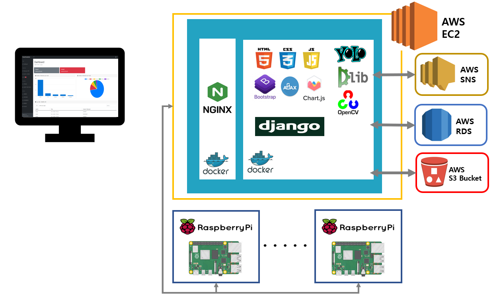
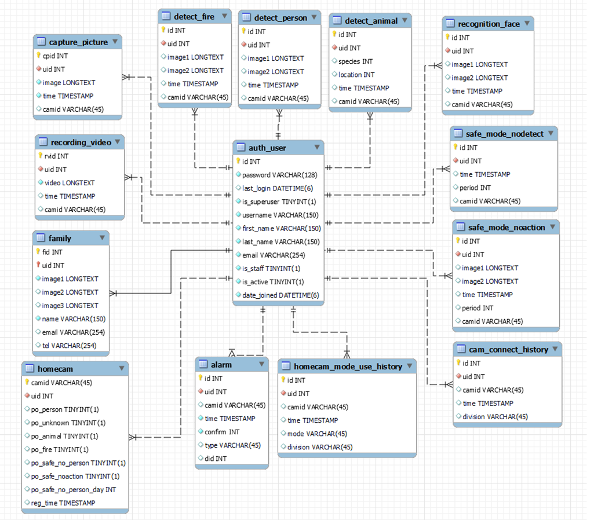
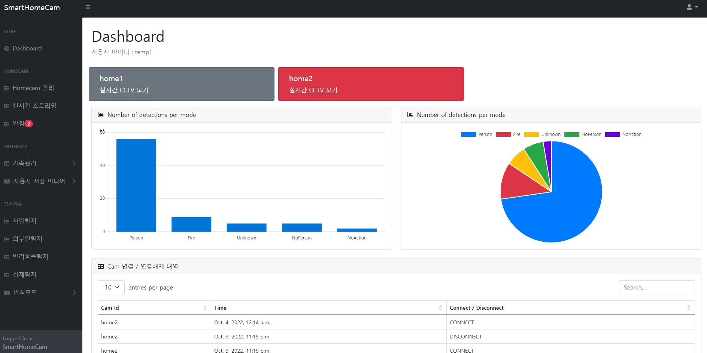

# SmartHomeCam (졸업작품)

작품 주제 : 라즈베리파이와 인공지능을 이용한 스마트 라카메라 웹 서비스

주제 선정 배경 : 1인 가구의 증가와 반려가구 1500만 시대에 외출 중에 카메라를 통해 집안상황 확인, 방범 서비스, 화재감지, 반려동물을 확인을 할 수 있습니다.

작품명 : SmartHomeCam

개발기간 : 2022.03 ~ 개발 중(90%)

 

## **작품 구성도**

1. 서비스 구성도

 

## **데이터베이스**

- auth_user : 사용자 정보
- homecam : 사용자 계정에 연결된 홈카메라 정보
- family : 가구원 등록 정보
- capture_picture : 사용자 캡처 저장 정보
- recording_video : 사용자 녹화 영상 저장 정보
- homecam_mode_use_history : 홈카메라 5가지 모드 on, off 기록
- cam_connect_history : 라즈베리파이 연결, 해제 기록
- alarm : 알림 저장
- detect_person : 홈카메라 사람탐지모드 저장
- detect_aniaml : 홈카메라 반려동물탐지 모드 저장
- detect_fire : 홈카메라 화재탐지 모드 저장
- recognition_face : 홈카메라 외부인 탐지 모드 저장
- safe_mode_nodetect : 홈카메라 안심모드 사람 미탐지 저장
- safe_mode_noaction : 홈카메라 안심모드 사람 행동 미감지 저장

 

## **기능**

### - 회원 기능
회원가입과 로그인을 할 수 있습니다.
### - 홈카메라 실시간 모니터링
서버에 연결된 라즈베리파이의 카메라 영상을 실시간 모니터링할 수 있고, 동시에 이미지 캡처, 영상 녹화가 가능합니다. 저장된 이미지, 영상은 마이페이지에서 확인이 가능합니다.
### - 홈카메라 모드
사람탐지, 화재탐지, 외부인탐지, 반려동물 탐지, 안심모드(일정시간 사람미탐지, 행동미감지) 모드가 있습니다.
### - 모드 설정
연결된 각 라즈베리파이에 대해서 홈카메라 모드를 ON/OFF 할 수 있습니다.
### - 알림 확인
반려동물 탐지를 제외한 홈카메라 모드에 대해서 특정 상황 발생 시 알림이 생성되고, 마이페이지에서 확인이 가능합니다.
### - 이메일, SMS 알림
반려동물 탐지를 제외한 홈카메라 모드에 대해서 특정 상황 발생 시 등록된 이메일, 전화번호로 알림이 전송됩니다.
### - 가족관리
집에 거주중인 가족의 사진, 이메일, 전화번호를 등록합니다. 사진은 외부인 탐지 모드에 사용되고, 이메일과 전화번호는 알림에 사용됩니다.
### - 탐지기록 확인
홈카메라 모드 탐지기록을 각각 확인이 가능합니다.

 
 

## **홈카메라 모드**

사람탐지는 사람이 탐지되면 이미지 저장, 이메일, SMS 알림이 전송됩니다.

사람을 탐지할 때 YOLO 알고리즘을 사용합니다. 모델은 YOLO v4 Tiny를 사용합니다.

외부인 탐지는 데이터베이스에 저장된 가족멤버 사진과 실시간으로 인식되는 얼굴 사진을 비교해 외부인이라 판단되면 이미지 저장, 이메일, SMS 알림이 전송됩니다.

hog 기반의 dlib face detector를 사용해 얼굴을 인식하고 dlib을 이용한 facial landmark detection(5-point facial landmark)을 통해 DNN을 이용해 얼굴을 128개 벡터로 수치화한다. 데이터베이스에 저장된 얼굴 벡터와 실시간으로 인식된 얼굴 벡터의 유클리디안 거리가 0.5 미만일 경우 외부인으로 판단합니다.

화재탐지는 화재가 탐지되면 이미지 저장, 이메일, SMS 알림이 전송됩니다.

화재 탐지 시 YOLO 알고리즘을 사용합니다. 모델은 YOLO v3를 사용합니다.

반려동물탐지는 강아지, 고양이를 탐지해 탐지 시간, 탐지 위치를 저장해 이를 기반으로 마이페이지에서 활동성 통계 그래프를 볼 수 있습니다.

반려동물 탐지시 YOLO 알고리즘을 사용합니다. 모델은 YOLO v4 Tiny를 사용합니다.

안심모드는 일정 시간 사람 미감지, 사람 객체 움직임 미감지를 탐지합니다. 사람 탐지 시 YOLO 알고리즘을 사용합니다. 모델은 YOLO v4 Tiny를 사용합니다.

일정 시간 사람 미감지는 사용자가 지정한 시간동안 사람 객체를 미감지하면 이메일, SMS 알림이 전송됩니다.

사람 객체 움직임 미감지는 사람 객체 탐지 위치를 고려해 6시간 동안 행동이 미감지되면 사진이 저장되고, 이메일, SMS 알림이 전송됩니다.

 
 

## **동작 화면**

### **기능 - 계정**

---

회원가입과 로그인을 할 수 있습니다.

### **마이페이지**

---

### **기능 - 가족관리**

---

가구원을 등록, 조회, 수정, 삭제할 수 있습니다. 가구원을 등록할 때 이메일, 전화번호, 최대 3장의 얼굴사진을 등록할 수 있습니다.

여기서 입력한 이메일, 전화번호는 이메일, 메시지 알림 시 사용됩니다.

얼굴사진의 경우 외부인탐지 모드에서 외부인을 판단하는 기준으로 사용됩니다.

### **기능 - 실시간 스트리밍**

---

실시간 스트리밍을 확인할 수 있습니다. 이페이지에서는 녹음하기, 화면캡처, 연결끊기 기능이 있습니다.

녹음하기 버튼을 누르면 실시간 스트리밍으로 들어오는 이미지 프레임이 동영상으로 녹화가 시작되고, 다시한번 누르면 동영상이 저장됩니다.

화면캡처 버튼을 누르면 현재 이미지가 저장됩니다.

연결끊기 버튼을 클릭하면 홈캠과의 연결이 해제됩니다.

### **기능 - 사용자 저장 미디어 확인**

---

실시간 스트리밍 페이지에서 사용자가 저장한 동영상, 캡처 이미지를 조회, 삭제할 수 있습니다.

### **기능 - 홈캠 관리**

---

홈캠 관리 페이지에서는 DB에 저장된 홈캠에 대해서 알림 확인, 모드 설정을 할 수 있습니다. on/off 버튼을 클릭해서 모드를 활성화, 비활성화 할 수 있습니다.

알림 버튼을 클릭하면 위 페이지로 이동합니다. 특정 홈캠이 발생시킨 알림들을 확인할 수 있습니다.

미확인알림, 확인알림으로 구분되며, 자세한 내용보기를 클릭하면 해상 탐지에 대한 상세페이지로 이동합니다.

### **기능 - 알림확인**

---

홈캠에서 탐지하면 알림이 발생하는데, 알림 페이지에서는 이러한 알림들을 한번에 확인할 수 있습니다.

자세한 내용보기를 누르면 위 페이지와 같이 해당 탐지에 대해 상세내용을 제공합니다.

### **기능 - 홈캠 탐지 기록 확인**

---

5가지 홈캠 모드에서 탐지한 것들을 각 페이지에서 확인이 가능합니다. 자세히보기 버튼을 누르면 하단의 사진 페이지로 이동합니다. 삭제하기 버튼을 누르면 삭제됩니다.

### **기능 - 홈캠 탐지 기록 확인 - 반려동물**

---

반려동물 탐지의 경우 다른 모드와 다르게 그래프와 표 형태로 출력됩니다.

사용자가 원하는 날짜를 선택하고 조회하기 버튼을 클릭하면 그 날짜의 반려동물 탐지 기록을 보여줍니다. 

그래프의 경우 chart js를 이용했습니다.

### **기능 - 이메일, 메시지 알림**

---

반려동물 탐지를 제외한 모든 모드에서 특정 상황 만족 시 가구원 등록 시 입력된 이메일, 전화번호에 이메일, 메시지 알림을 전송합니다.

이메일 알림의 경우 원본사진, 객체 바운딩 사진이 함께 전송됩니다.

문자 메시지의 경우 텍스트로만 전송되고, AWS SNS를 이용했습니다.

