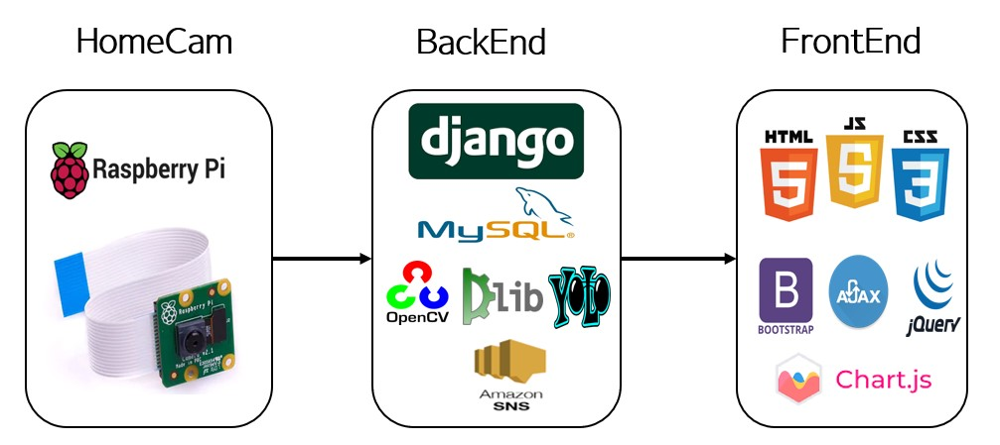
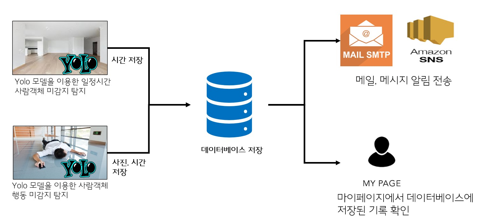

# SmartHomeCam (졸업작품)

## 작품 주제

라즈베리파이와 인공지능을 이용한 스마트 홈캠 웹 서비스

## 주제 선정 배경
1인 가구의 증가와 반려가구 1500만 시대에 따라 외출 중에  카메라를 통해 집안상황 확인, 방범 서비스, 화재감지, 반려동물을 확인을 할 수 있다.

 

## 작품명
SmartHomeCam

 

## 개발기간

2022.04 ~ 개발 중

 

## 작품 구성도

1. 서비스 구성도

 

2. 기능 구성도

 

## 작품 기능

### 기능 - 계정

### 기능 - 스마트 홈캠

사람탐지 모드입니다.

얼굴인식 모드입니다.

화재탐지 모드입니다.

반려동물 탐지모드입니다.

안심모드 입니다.

 
 

### 기능 - 마이페이지

 
 

## 데이터베이스

